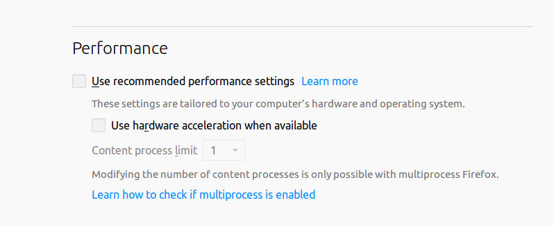

# Nvidia-docker-Ubuntu 18.04-Mate-Desktop with GPU
Reference:
> https://github.com/LeoCHANGcn/Nvidia-docker-Ubuntu-16.04-Unity-Desktop-TensorFlow-with-GPU
> https://github.com/chenjr0719/Docker-Ubuntu-MATE-noVNC

> ### Environment
>
> - CUDA 12.4
>
>
> - Python 3.10
> - Docker in docker
> - Terminator
> - Chrome browser


## How to build?

First, your computer should have at least one Nvidia video card with compute capability greater than or equal to 3.5 and installed proper driver (higher than 384.81 version) for it. 

Second, you need to install Nvidia-docker following the instructions on this web page: [Nvidia Docker](https://github.com/nvidia/nvidia-docker/wiki/Installation-(version-2.0))

After installing Nvidia-docker, you can build this **Dockerfile**:

```
sudo docker build -t ubuntu22.04-novnc:latest .
```


## How to use?

The default usage of this image is:

```
docker run --gpus=all -itd -p 16069:6080 -v /var/run/docker.sock:/var/run/docker.sock -v /dev/shm:/dev/shm -e PASSWORD=ubuntu -e SUDO=yes --shm-size=20G --privileged ubuntu22.04-novnc:latest
```

> **Tips:**
>
> "-e PASSWORD =ubuntu"  aims to set a password as "ubuntu" for you.
>
> (This password is for noVNC login and system login.)
>
> "-e SUDO=yes" aims to let you login as a user with root permission. (**Recommended**)

> If you don't set "-e PASSWORD=$your_password" option,  the password will create randomly, to find it, please use the following command:
>
> ```shell
> sudo docker exec $CONTAINER_ID cat /home/ubuntu/password.txt
> ```
>
> And if you don't set "-e SUDO=yes" option, you cannot use "sudo" command in the system.


## Password Changing

You can change your system login password by using:

```shell
passwd
```

And input new password following the hints. (New password should be at least 8 numbers or letters).

**Note:** You can just change the system login password, but can't change the noVNC login password.

## Other options

#### Lock Screen

```shell
gnome‐screensaver‐command ‐l
```


#### Anaconda

If you want to use Anaconda to manage your python environment, first install Anaconda and create a virtual environment, for example "conda create -n tf35 python=3.5". Then you should copy "/usr/local/lib/python3.5/dist-packages/cv2.so" and "/usr/local/lib/python3.5/dist-packages/cv2.cpython-35m-x86_64-linux-gnu.so" to "$your_Anaconda_path/env/tf35/lib/python3.5/site-packages" directory. And you cannot use **OpenCV** this way for python version higher than 3.5 but only **lower or equal to 3.5**.

If you use jupyer, you should use "jupyter notebook **--ip=0.0.0.0**" to start the notebook. And if you use jupyter notebook, I suggest that you map the port 8888 out to your host and access jupyter notebook by your local host browser for the Firefox browser in the container often crashes.

#### File Transportation

> Need to expose port 22 of the container.

Use "scp" command if your system is os X or Linux.

Use [MobaXterm](https://mobaxterm.mobatek.net/) for windows user.


## Issues

Some components of Unity may not work properly with vncserver.

## Fix the crash problem of Firefox Browser

Sometimes you meet tab crash problem with Firefox:


To fix that, you need to input "about:preferences" in the address bar and press enter, and cancel the tick of the following options:



And input "about:config" in the address bar, double click to modify the following options:

- browser.tabs.remote.autostart = false
- browser.tabs.remote.autostart.2 = false (Optional)
- webgl.disable-wgl = true
- webgl.disabled = true
- webgl.enable-webgl2 = false

Finally, restart Firefox, hope solve the crash problem!

